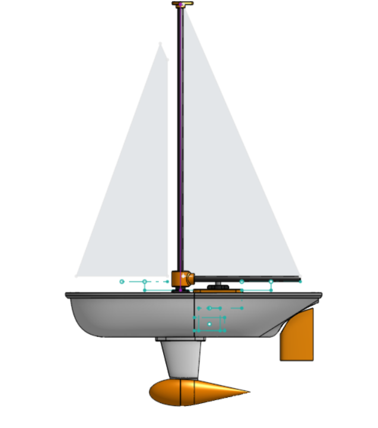

The sailboat is a simple 2 sail design with a mainsail and a job. It uses to some standard RC components and servos to control everything. 
 Here is a link the the onshape file: <a href="https://cad.onshape.com/documents/8c2f88295e883c078405b00a/w/97e82738b100c77464d9b9e1/e/f8fc11fc271681272504e036?renderMode=0&uiState=68a4a6231145026e23bdc979">RC Sailboat</a>
