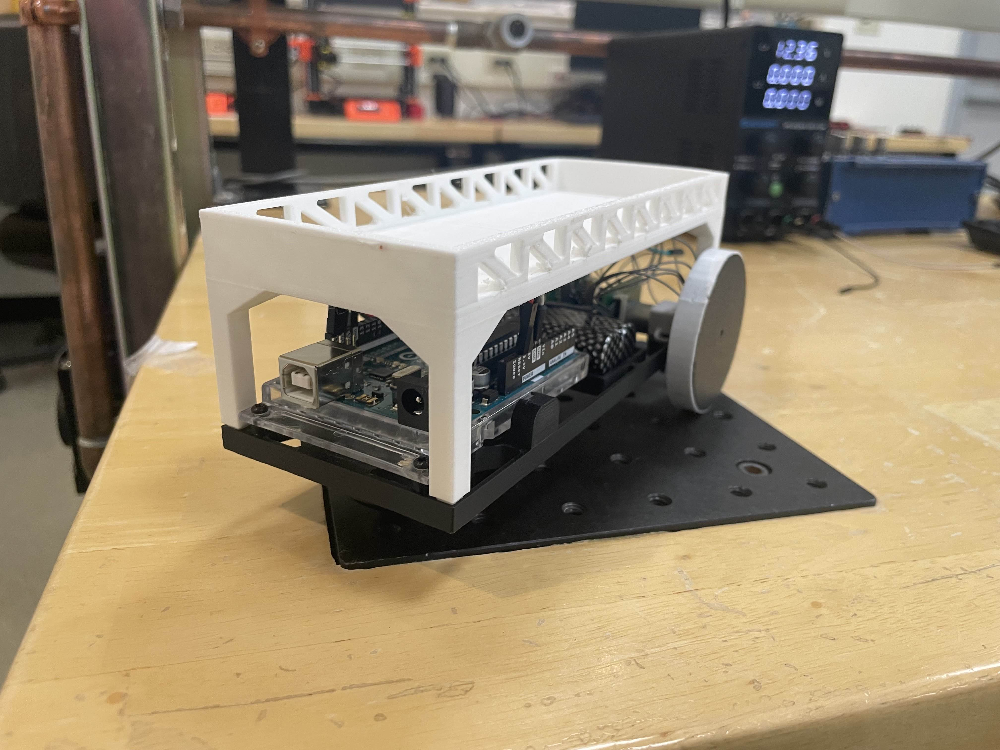
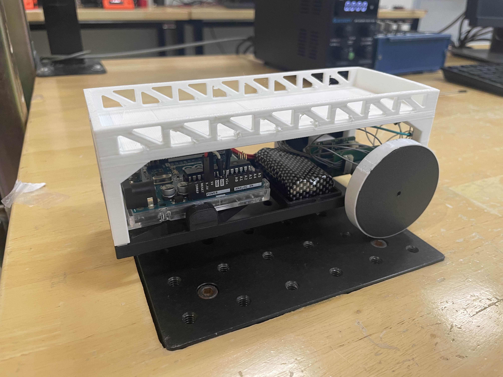

<table border="0">
  <tr>
    <td>
      <h1>Novel Car</h1>
      
For this project, my team designed a car that utilised our knowledge of classical Control Theory to control and accomplish the following goals:

      <ul>
        <li><b>Straight-Line Motion:</b> The robot must travel a distance of 1 meter in a straight line at the
        maximum speed achievable without significant deviation from the path</li>
        <li><b>Path Navigation with Turns:</b> The robot should travel 1 meter straight, execute a precise 90-
        degree left turn, and then continue for another 1 meter in a straight line. The turn should be
        smooth, and the robot must stay aligned with the new path</li>
        <li><b>PID Tuning for Stability:</b> The PID controller should be tuned to minimize overshoot and
        steady-state error, achieving a stable response. The tuning will be assessed by the smoothness of
        the robot’s movements and its ability to stay on the desired path</li>
        <li><b>Payload Robustness:</b> The robot should demonstrate the ability to carry the maximum possible
        number of lightweight wooden blocks without dropping them. Students will be evaluated on both
        the number of blocks carried and the stability of the robot’s motion while carrying the load.</li>
        <li><b>Completion Time and Position Accuracy:</b> Each group’s performance will be timed for every
        task. Additionally, the robot’s final position after each run will be measured to calculate the
        positional error. Groups are allowed to attempt tasks multiple times, but all demonstrations must
        be completed within a total of 8 minutes. The best performance in terms of time, accuracy, and
        stability will be considered for evaluation</li>
        <li><b>Creative Customization Bonus:</b> Groups will have the opportunity to modify the robot’s body
        using the provided CAD files. The modifications should enhance functionality, aesthetics, or usabil-
        ity. At the end of the session, groups will vote for the most creative and impactful customization.
        The group receiving the most votes will earn a bonus for creativity</li>
      </ul>
    </td>
    <td>
    <iframe align="center" width="350" src="https://www.youtube.com/embed/CIV7w5zYyt8?si=UowjZ_uuEgWjiVrI" title="YouTube video player" frameborder="0" allow="accelerometer; autoplay; clipboard-write; encrypted-media; gyroscope; picture-in-picture; web-share" referrerpolicy="strict-origin-when-cross-origin" allowfullscreen></iframe></td>
  </tr>
  <tr>
  <td></td>
  <td>We were able to tune our PID paramenters in order to carry 6 blocks stacked on top of each other. I focused on designing our custom vehicle, focussing on making the electronics mounting more streamlined and making it look nicer for the design bonus.You can find the CAD <a href="https://cad.onshape.com/documents/246e00bf889f9cb18e4335c6/w/3250d7a28b8f74f00add2b1f/e/7e8138ecf92d701753da1477?renderMode=0&uiState=68bdc952a1473711a2610c14">here</a>, and the report <a href="../img/classes/es3011report.pdf">here</a>.</td>
  </tr>
</table>