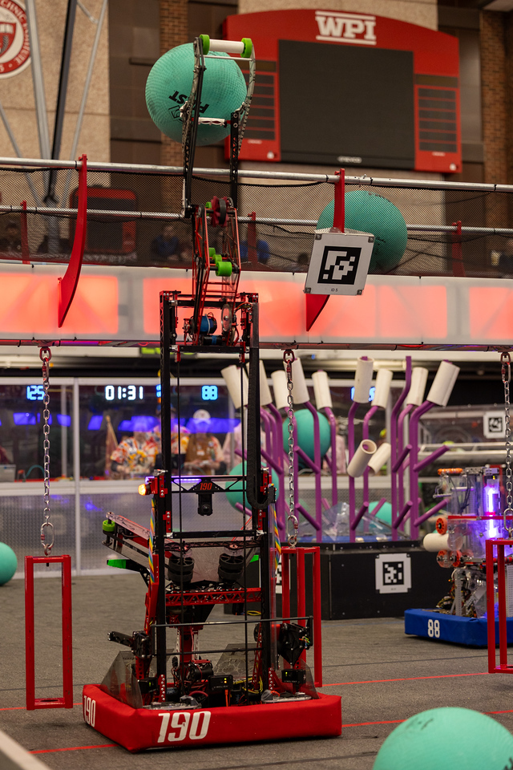
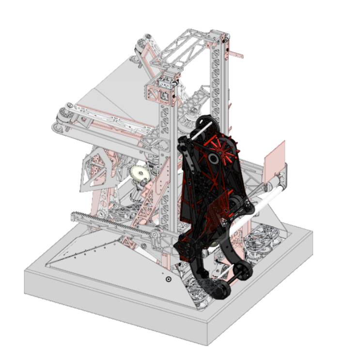
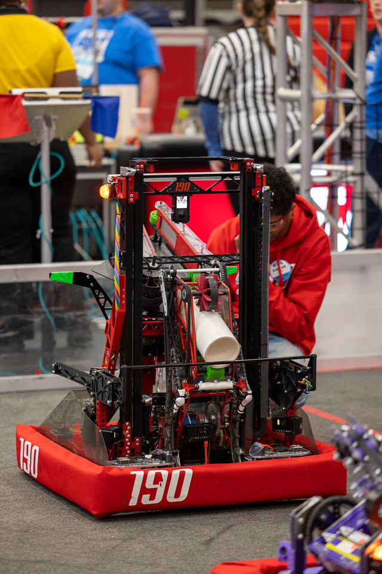

<h1>2025: Redundancy

    
    
    

A robot made for the 2025 FRC game, Reefscape. Its objective was to score pvc pipes onto posts and score large kickballs into a net ~8 ft in the air. It competed at a very high level and made it far into its division at worlds. I worked mostly on the scoreing/claw subystem.

<h1>2024: Snapback
