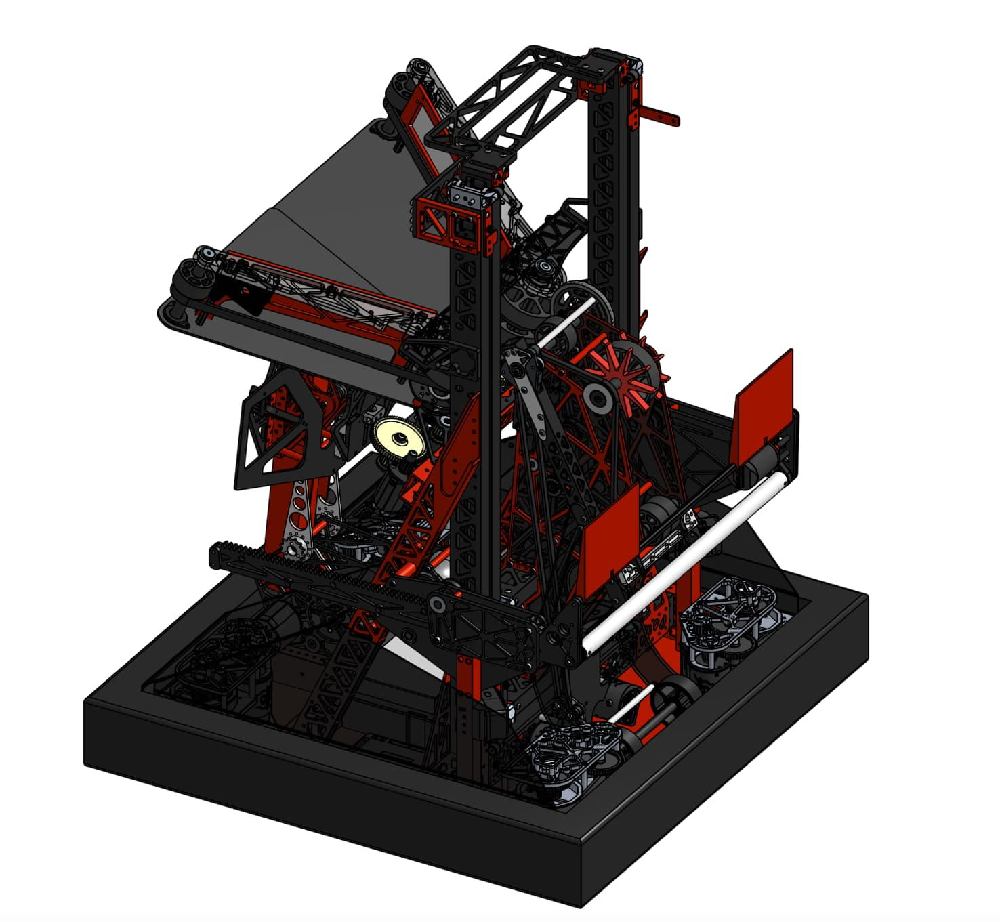
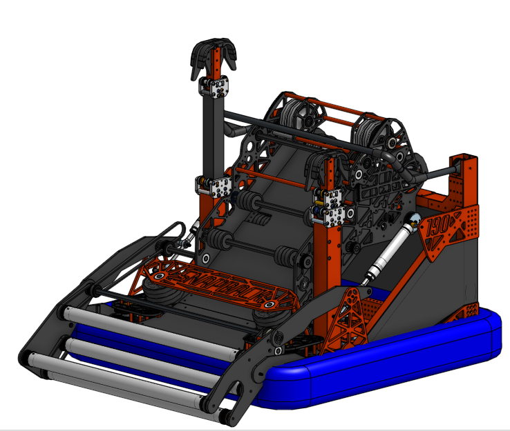
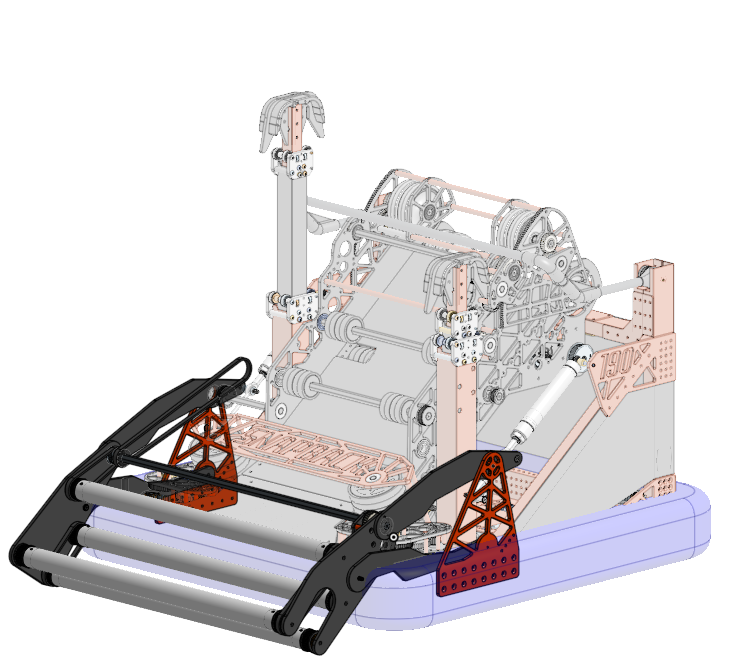
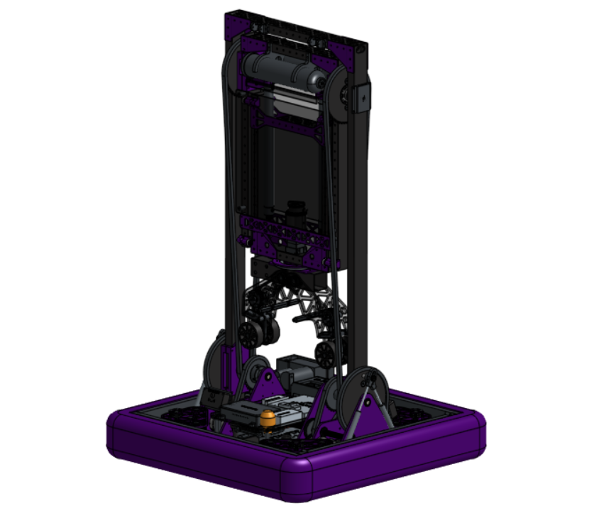
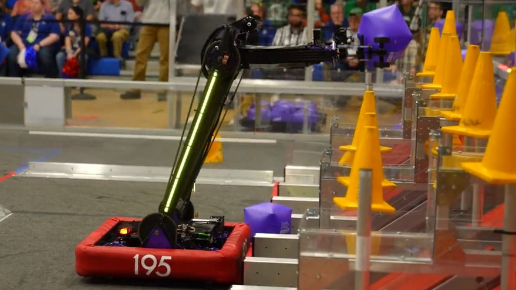
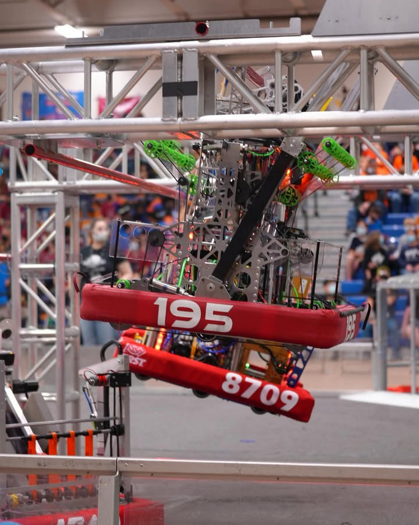

<h1>2025: Redundancy</h1>

    
    
    
    

This robot was designed for the 2025 FRC game, "Reefscape." Its primary goals were to score PVC pipes on elevated posts, launch large kickballs into a net approximately 8 feet high, and climb onto a rectangular "cage." The robot performed at a very high level, advancing far into its division at the world championships. My main contributions were to the scoring and claw subsystem. The robot was originally designed in Onshape.
<a href="<a href="https://cad.onshape.com/documents/8c2f88295e883c078405b00a/w/97e82738b100c77464d9b9e1/e/f8fc11fc271681272504e036?renderMode=0&uiState=68a4a6231145026e23bdc979">CAD</a>
<a href="<a href="https://www.thebluealliance.com/team/190/2025">TBA</a>

<h1>2024: Snapback</h1>

    
    
    

Designed for the 2024 FRC game, "Crescendo," this robot was built to score orange rings into a goal and climb onto a chain. It won its division at the world championships. My primary role was in developing the intake subsystem. The robot was originally designed in SOLIDWORKS.
<a href="<a href="https://www.thebluealliance.com/team/190/2024">TBA</a>

<h1>2023: KightTime</h1>

    
    
    
    

This robot was created for the 2023 FRC game, "Charged Up." Its primary objective was to score cones on poles and cubes on shelves, then balance on a platform with its alliance partners. It competed at a very high level and went far into its division at the world championships. The robot was originally designed in SOLIDWORKS.
<a href="<a href="https://www.thebluealliance.com/team/195/2023">TBA</a>

<h1>2022: KightTime</h1>

    
    

Designed for the 2022 FRC game, "Rapid React," this robot's main objective was to score large tennis balls into a central goal and climb a monkey bar-like structure. It was originally designed in SOLIDWORKS.
<a href="<a href="https://www.thebluealliance.com/team/195/2022">TBA</a>

