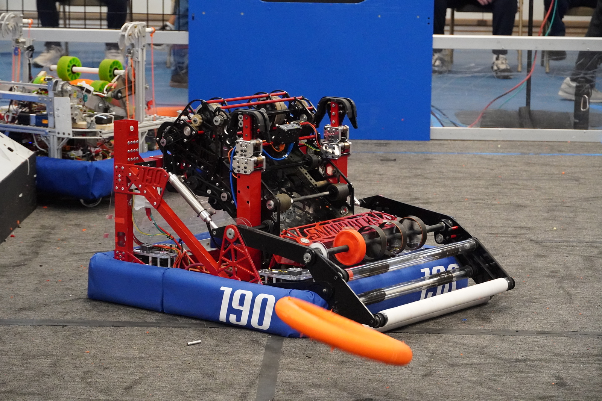

<h1>2025: Redundancy</h1>

    
    
    
    

A robot made for the 2025 FRC game, Reefscape. It's objective was to score pvc pipes onto posts and score large kickballs into a net ~8 ft in the air, and then climb onto a rectangular 'cage'. It competed at a very high level and made it far into its division at worlds. I worked mostly on the scoreing/claw subystem. Originally cadded in Onshape
<a href="<a href="https://cad.onshape.com/documents/8c2f88295e883c078405b00a/w/97e82738b100c77464d9b9e1/e/f8fc11fc271681272504e036?renderMode=0&uiState=68a4a6231145026e23bdc979">CAD</a>
<a href="<a href="https://www.thebluealliance.com/team/190/2025">TBA</a>

<h1>2024: Snapback</h1>

    
    
    

A robot made for the 2024 FRC game, crescendo. It's objective was to score orange rings into a goal and climb onto a chain. It won its division at worlds. I contributed mainly to the intake subsystem. Originally cadded in SOLIDWORKS.
<a href="<a href="https://www.thebluealliance.com/team/190/2024">TBA</a>

<h1>2023: KightTime</h1>

    
    

A robot made for the 2023 FRC game, Charged Up. It's main objective was to score cones onto poles and cubes onto shelf, then balance with its partners. It competed at a very high level and made it far into its division at worlds. Originally cadded in SOLIDWORKS.
<a href="<a href="https://www.thebluealliance.com/team/195/2023">TBA</a>

