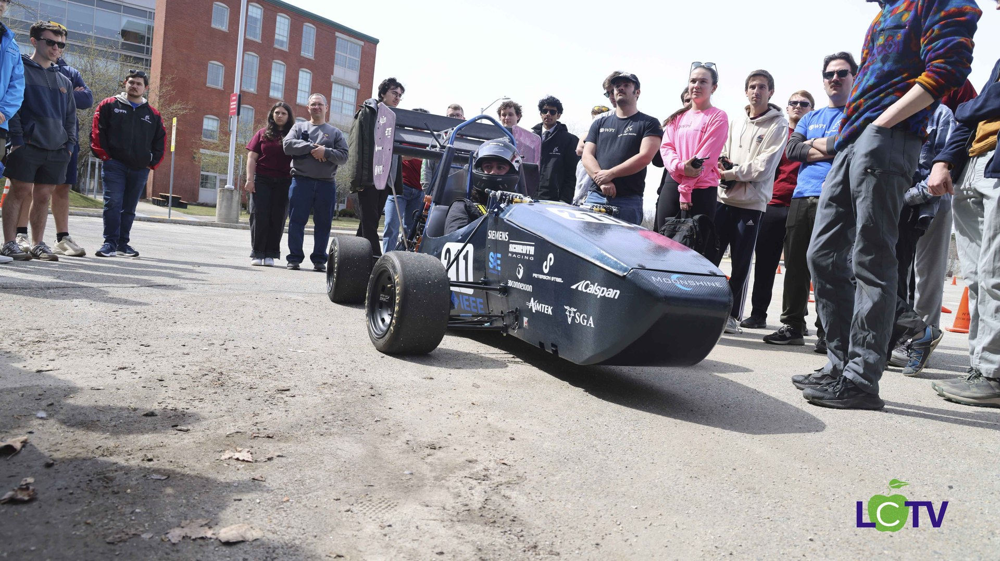

<h1>WPI Formula SAE</h1>

<em>2026-2027 season</em>

Formula SAE is an intercollegiate competition where student teams design, build, and race a formula-style car. WPI's team runs a full season, from concept through fabrication to competition.

I am working on design and manufacturing this year. This page will be filled in as the season progresses.

