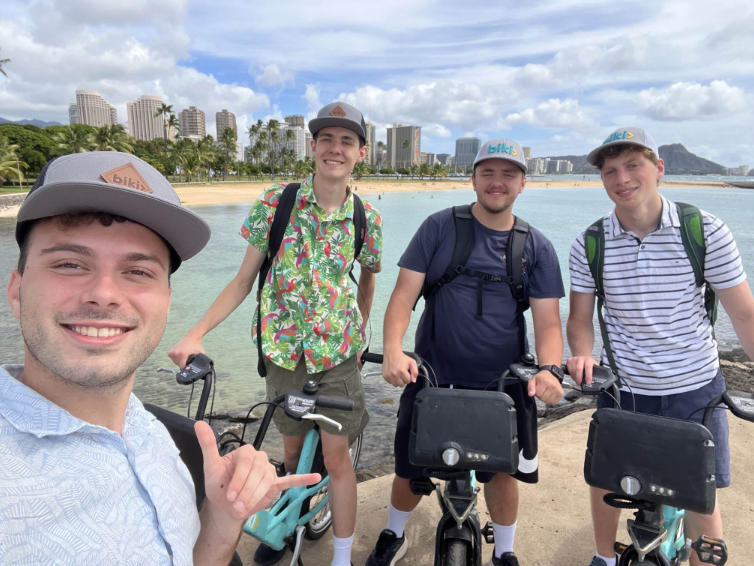
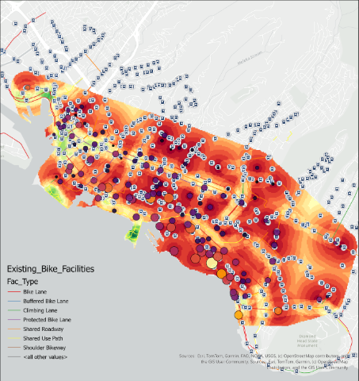
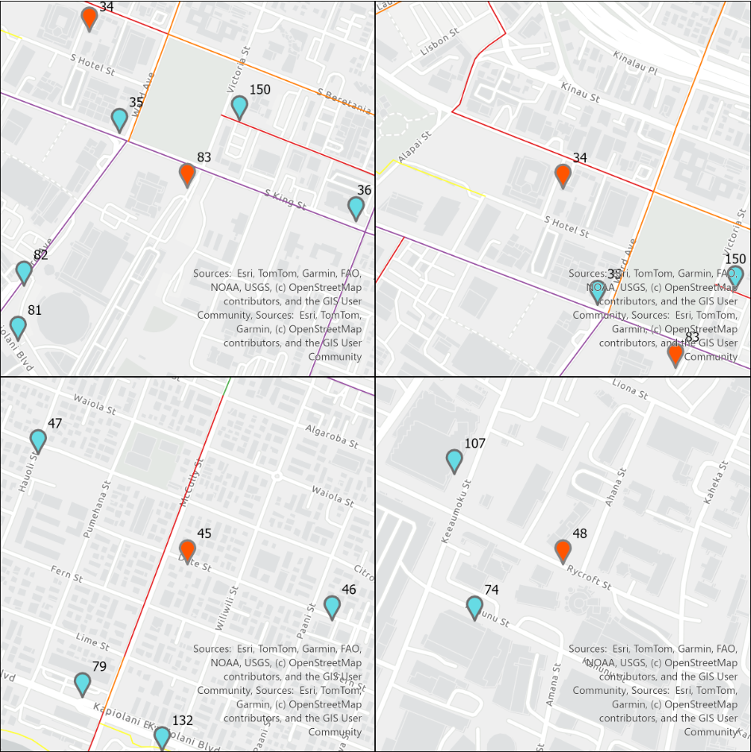
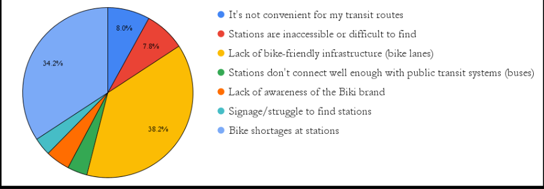
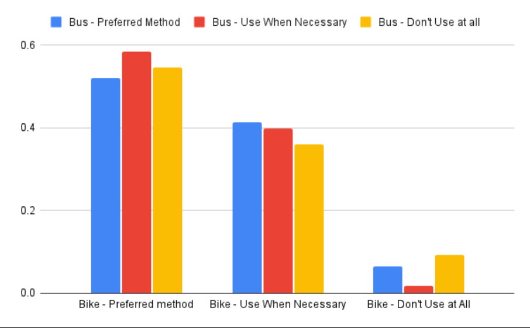

<h1>Honolulu Bike Share Network Optimization</h1>

<em>Interactive Qualifying Project &middot; Secure Bike Share, Honolulu, HI &middot; Aug. to Dec. 2025</em>

My team spent a term in Honolulu working with Secure Bike Share, the operator of the city's bike share system, on where the network should grow and why ridership was lower than it could be.

<h2>Where the Stations Should Go</h2>

  

    
  

  

    
I built suitability models in ArcGIS Pro that layered census demographics, transit access, and existing bike-lane coverage into a single continuous surface across Honolulu. Warmer areas score higher, meaning the underlying demand and infrastructure are already there to support a station.

    
Overlaying the current network on that surface makes two things visible at once: which high-scoring areas have no station near them, and which existing stations sit in low-scoring ground.

  

From that surface I produced a shortlist of specific intersections for the operator to evaluate, paired with a ridership-weighted ranking of existing stations that flagged relocation candidates. The result is a concrete list of sites with reasoning attached to each one.

<h2>Asking the Riders</h2>

We designed a demographically conditioned survey and distributed it through the operator's 20,000-person mailing list under IRB approval. The 233 responses pointed clearly at two barriers above all others.

Lack of bike-friendly infrastructure accounted for 38.2% of responses and bike shortages at stations for 34.2%, together making up roughly three quarters of all reported barriers. Station findability, brand awareness, and transit connection each landed in the single digits. The client had expected pricing and app experience to rank higher, so this reframed where investment would actually move ridership.

Cross-tabulating bike share usage against bus usage showed that people who avoid the bus are just as likely to prefer biking as people who ride it regularly. Bike share attracts riders across the transit spectrum, which supports treating bus stops as a way to reach new riders.

<h2>Deliverables</h2>

I authored the team's final technical report and the client-facing improvement plan. That plan included a matched control-group methodology for measuring whether QR way-finding signage increases bus-to-bike transfers, giving the operator a way to measure the effect before committing to a full rollout.

  <a href="../img/classes/IQP%20Report_%20Full%20Draft.pdf">Read the Full Report</a> 
  <a href="../img/classes/Prioritized%20Improvement%20Plan%20_3.pdf">Read the Prioritized Improvement Plan</a>

