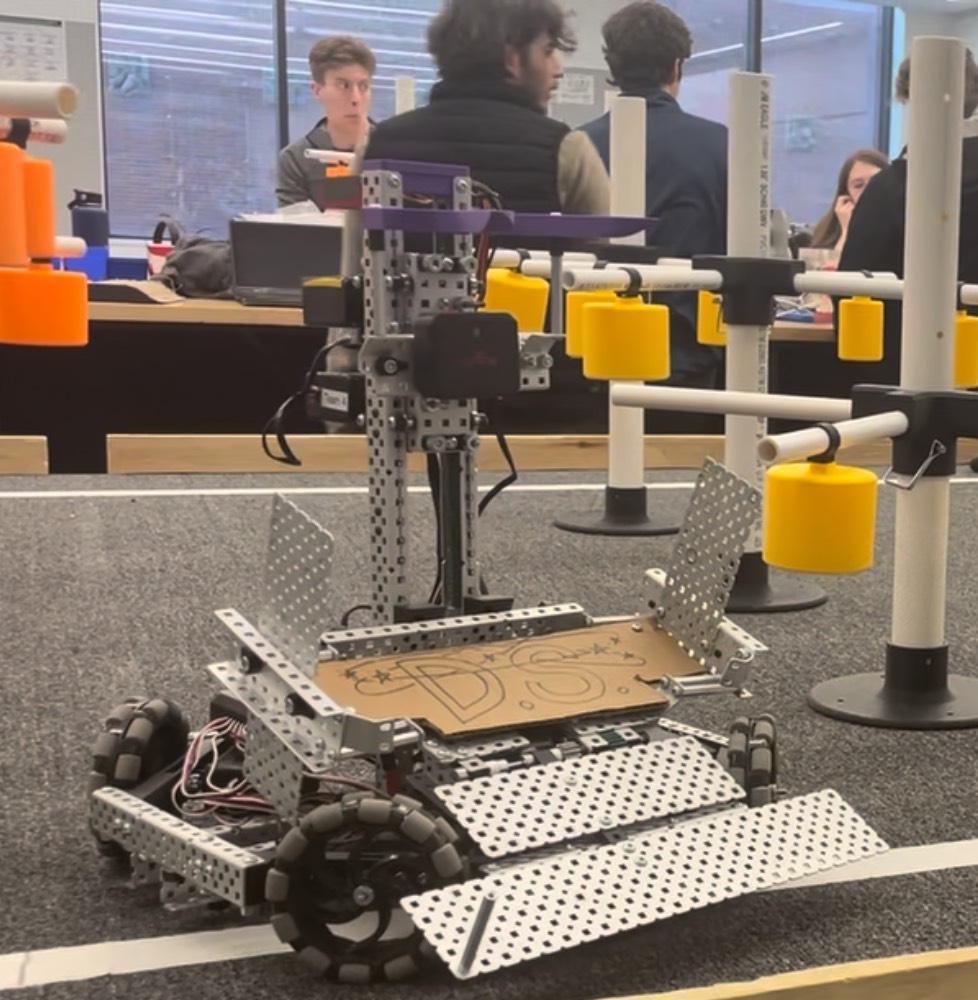

 
This is a vex robot that my team and I built for our RBE1001 class. It was able to autonomously navigate the 'Orchard' and collect 'fruit'. Some aspects of this project included:
<ul>
  <li>Designing and 3D printing custom parts</li>
  <li>Working with different sensors such as encoders, distance sensors, line sensors, and cameras</li>
  <li>Creating a state machine to automatically navigate</li>
</ul>
<a href="../img/classes/Group_4_Final_Proposal-1.pdf">Read the Full Report</a>
