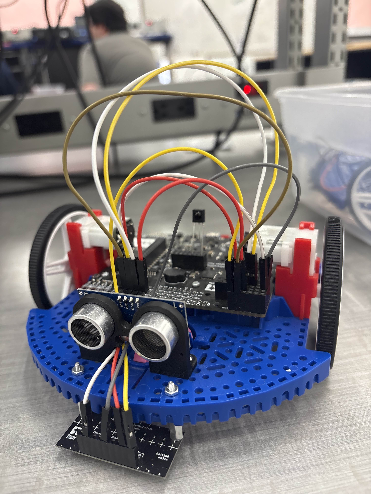

<h1>Sensors and Actuators</h1>

The RBE 2000-level sequence was where the mechanical and electrical sides of robotics finally met for me. The work covered actuation, feedback, and the structural analysis behind the hardware.

<ul>
  <li>Analyzed stress and structural integrity using SOLIDWORKS FEA</li>
  <li>Applied inverse kinematics to control a double-jointed arm, driving it to arbitrary points and using it to draw images</li>
  <li>Controlled servos and brushed/brushless motors with ESCs, read encoder feedback, and built custom embedded circuits on Arduino and Raspberry Pi Pico</li>
  <li>Used a custom library to control a two-wheeled robot autonomously with a range of onboard sensors</li>
</ul>
