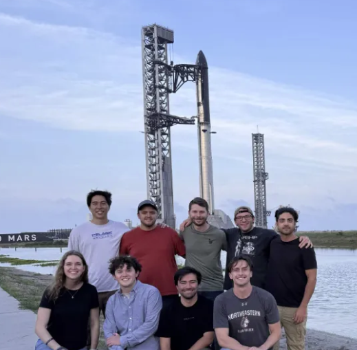

<h1>Vehicle Design Intern, SpaceX Starbase</h1>

<em>May to Aug. 2026</em>

I spent the summer as a Vehicle Design Intern at Starbase, working inside a larger engineering group on vehicle structures and hardware.

<h2>Drawings and Tolerancing</h2>

I created detail drawings from scratch, defining datum schemes, running tolerance stack-ups, and writing GD&amp;T callouts informed by what the manufacturers could realistically hold. Getting a callout right meant talking to the people who would actually cut the part and setting the tolerance to match their process.

<h2>Design and CAD</h2>

Alongside the drawing work I completed initial CAD on ship structures, taking hardware from early layout through a modeled design that had to fit alongside the systems around it. All modeling and drawing release ran through Siemens NX and Teamcenter. Learning to work inside a controlled release workflow alongside a large team was probably the single most useful thing I picked up over the summer.

<h2>Design for Manufacturability</h2>

I also contributed Design for Manufacturability changes across Ship, revising geometry so parts could be built and assembled more easily without giving up what they needed to do.

